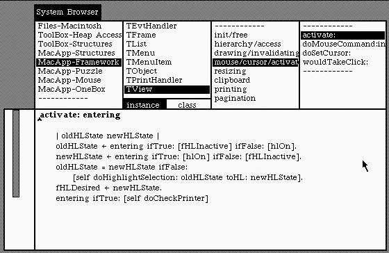

# Symbol Browser (Class Browser)

Symbol browsers are probably one of the oldest UI patterns that are specific to code editors and distinguish them from "usual" text editors.

They originate in the Smalltalk class browser.

There isn't even a way to browse the whole code as a "file". Instead, the top columns show (in that order) *categories* in the system, the *classes* in the selected module, *method categories* in the selected class, and finally the actual *methods* themselves. The editor pane below allows to edit the currently selected method.

## Symbol Browser vs Class Browser

A class browser is typical for class-based OOP languages, but is just a special form of a **symbol browser**. Symbols of a programming language can be packages, modules, classes and methods, but also variables or tags (if it is a declarative language). In Prolog, facts and rules are symbols.

Depending on the language and environment, a symbol browser may help to navigate any of those. The pane-based approach, as pioneered by the Smalltalk class browser, is one way, but most modern IDEs work with an *outline* view instead.

[Read more on class browsers on Wikipedia](http://en.wikipedia.org/wiki/Class_browser).

## Examples

[Eclipse](/ides/eclipse.md) uses an outlining class browser, which is integrated into its project explorer.

[Sublime Text](/ides/sublime-text.md) allows accessing symbols through fuzzy matching using the keyboard shortcut `Ctrl+R` (`Cmd+R` on OS X).
